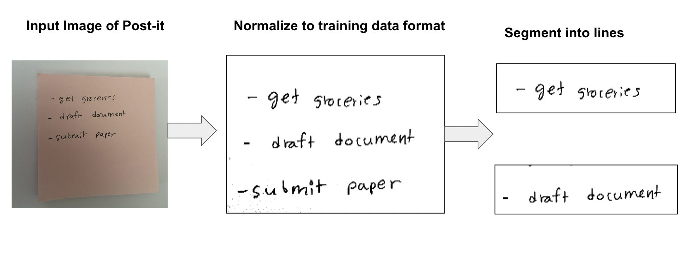
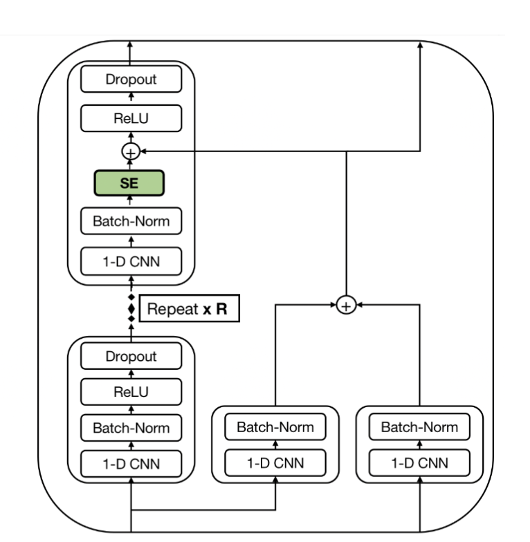
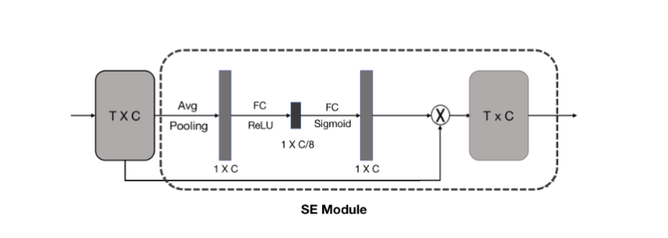

# Image of handwritten notes to text
**What does this do?**

This project converts an image of post-it notes and extract the texts using deep learning based computer vision model.

**How is this accomplished?**

The machine learning component involves a number of Computer Vision tasks, namely:
>  **Image preprocessing** -Converts post-It notes into a similar format as the training data
> 
>  **Line segmentation**  - Segments text in the post-it into lines 
> 
>  **Handwriting Text Recognition.** - Converts lines to texts using Easter2 Model, a convolution based model with dense residual connections and squeeze and excitatoin modules

The model is trained on publicly available data.

### Pre-Processing
Training data comes line by line and looks something like this:

I apply the following steps to normalize the images into similar format as training data

### Line to text - Easter2 Model
Easter2 Model is composed of
1) Repeating blocks of 1-D CNN->Batch-Norm->ReLU->Dropout
2) Dense Residual Connections
3) Squeeze and excitaton module

#### Squeeze and Excitation Module

Squeeze and Excitation Module or SE starts by average pooling local features, then applies 2 fully connected layer and returns a context vector.
The context vector is multiplied element-wise with the local features.
### Dataset
IAM (IAM Handwriting)
- 13,353 images of handwritten lines of text created by 657 writers
- writers transcribed text from Lancaster-Oslo/Bergen Corpus of British English
- total of 1,539 handwritten pages 
- 115,320 words
- The database is labeled at the sentence, line, and word levels
- Dataset paper: The IAM-database: an English sentence database for offline handwriting recognition

Accessing dataset:
- You need to register first at https://fki.tic.heia-fr.ch/databases/iam-handwriting-database
- Github repo with data download python notebook: https://github.com/kartikgill/Easter2/blob/main/notebooks/iam_dataset_download.ipynb
- Train-test split: wget https://www.openslr.org/resources/56/splits.zip

The papers can be found under model/papers directory.
### Model Performance
I use the standard metric of CER, or Character Error Rate.
The state-of-the-art character error rates below 3% are achieved through internal and synthetic dataset.  
The transformer based model TrOCR by Microsoft achieves a CER of 2.89% but they use synthetic dataset.
Easter2 is the SOTA when using IAM Handwriting dataset only, achieving SOTA of 6.21%

### Citation
@article{chaudhary2022easter2,
  title={Easter2. 0: Improving convolutional models for handwritten text recognition},
  author={Chaudhary, Kartik and Bali, Raghav},
  journal={arXiv preprint arXiv:2205.14879},
  year={2022}
}

Below are some resources used to aid in the project. 

Other  
Flask:
https://roytuts.com/upload-and-display-image-using-python-flask/

Terminologies:
HTR- Handwriting Text Recognition
Squeeze and Excitation (SE) module
Youtube lecture: https://www.youtube.com/watch?v=BSZqvObJVMg&ab_channel=MaziarRaissi

CTC- Connectionist Temporal Classification
https://www.youtube.com/watch?v=c86gfVGcvh4&ab_channel=CarnegieMellonUniversityDeepLearning

Dense Residual Connection

CER- Character Error Rate
